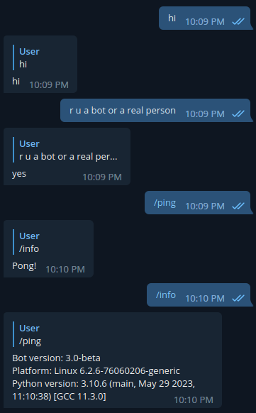

<h6 align="center">
</img><br>
 <i>(not that Z!)</i>
</h6>

<p align="center"><b>reZov</b> is an open-source bot for Telegram based on aiogram. It is a fork of another bot - <a href="https://codeberg.org/voZer-project/voZer/">voZer.</a><br>
  The main goal at the moment is to improve the codebase and fix the errors.</p>
<p align="center">At the moment, the bot is only available in Russian language.</p>

> [!WARNING]
> The branch is not completed yet! Some functions are broken!

## Main features
- Text generation based on a Markov chain [(markov_schizo.py)](src/Extensions/markov_schizo.py)
- "On this day" (Wikipedia API) [(today.py)](src/Extensions/today.py)
- Web search (LibreY API) [(search.py)](src/Extensions/search.py)
- Send messages to all users [(admin.py)](src/Extensions/admin.py)
- Weather (wttr.in API) [(wttr.py)](src/Extensions/wttr.py)
- */send*ing messages to the administrator [(admin.py)](src/Extensions/admin.py)
#### Also some fun features:
- Randomizer [(random.py)](src/Extensions/random.py)
- bessrom turbo pabji smooth [(bessrom.py)](src/Extensions/bessrom.py)
- blok chat or someone!!!1!! [(fun.py)](src/Extensions/fun.py)
- Send */casino* emoji or */dice* emoji [(fun.py)](src/Extensions/fun.py)
## Demo



## Installation

1. Clone repository:
```
git clone https://github.com/nediorg/reZov.git
```
2. Install packages:
```
pip install -r requirements.txt
```
3. Write your config in [config.py](src/config.py)
4. Start bot:
```
python3 main.py
```
5. You're awesome!

## Contributing

If you find any bugs or have suggestions for new features, feel free to create an issue or submit a pull request. All contributions are welcome!

##  License

This project is licensed under the **GNU GPL v3.0**. See the `LICENSE file` for more information.
